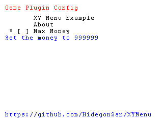

# XY Menu

This plugin reproduces the old XY menu with CTRPF  
Original is [here](https://github.com/44670/NTR)

## Demo



```cpp
XYMenu::Menu *menu = new XYMenu::Menu();

menu->Entry("XY Menu Example");
menu->Entry("About", "Made by Hidegon");
menu->Entry("Max Money", "Set the money to 999999", MaxMoney);

while (true) {
    menu->Run();
}

delete menu;
```
